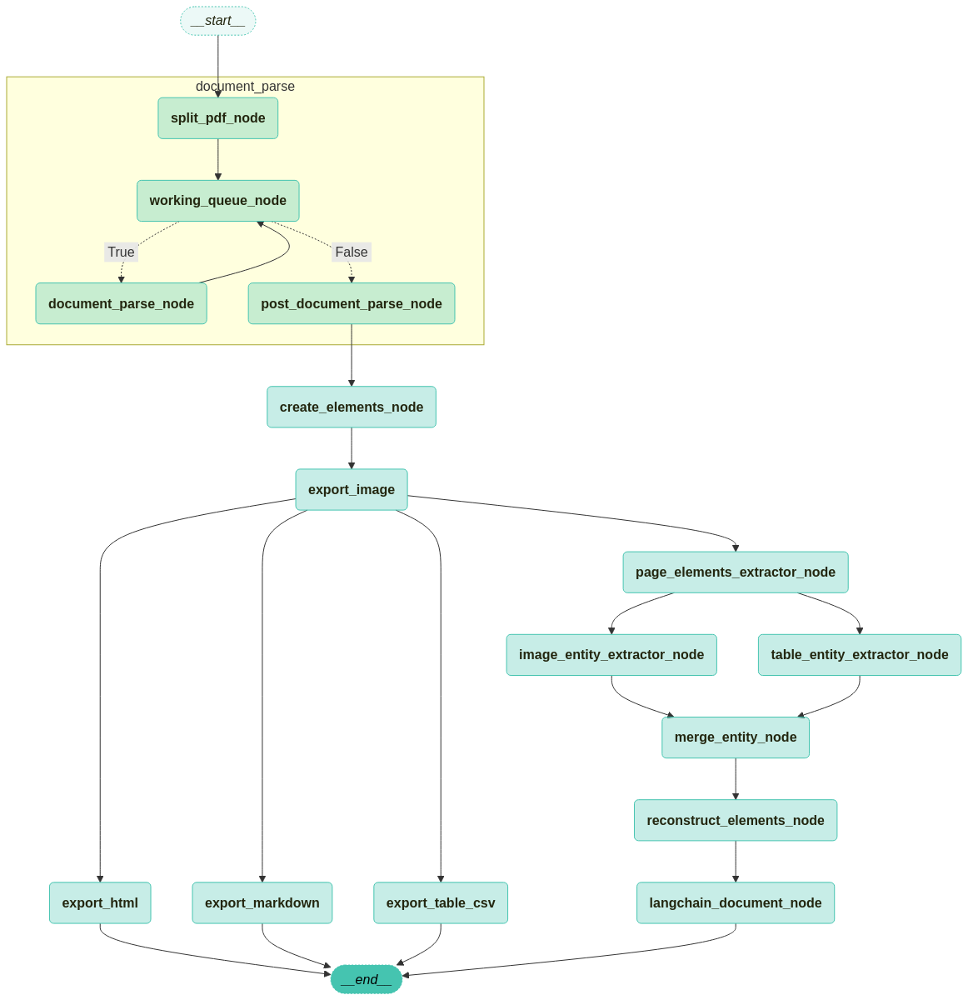

# TeddyNote Parser Client

TeddyNote Parser API를 사용하기 위한 Python 클라이언트 라이브러리입니다.

> Parser 구조 예시


## 바로가기

- [예제 코드: PDF 파싱 실습 노트북](example/parse_pdf.ipynb)
- [API 서버 실행 가이드](#teddynote-parser-api-서버-실행하기)
- [클라이언트 설치 방법](#설치)
- [클라이언트 사용 예시](#사용-방법)
- [API 참조 문서](#api-참조)

## TeddyNote Parser API 서버 실행하기

먼저 TeddyNote Parser API 서버를 Docker Compose를 사용하여 실행합니다.

### 1. 환경 변수 설정

제공된 `.env.example` 파일의 이름을 `.env`로 변경하고 필요한 값들을 설정합니다.

```
# .env.example 파일의 이름을 .env로 변경
# Windows: .env.example 파일을 마우스 오른쪽 버튼으로 클릭하고 '이름 바꾸기' 선택
# macOS: .env.example 파일을 선택하고 Enter 키를 눌러 이름 변경
```

`.env` 파일을 열고 다음 변수들을 설정합니다.

```
PORT=9997                      # API 서버 포트
UPSTAGE_API_KEY=your-key-here  # UPSTAGE API 키
OPENAI_API_KEY=your-key-here   # OpenAI API 키

# 볼륨 경로 설정 (선택 사항, 절대 경로 권장)
# macOS 예시 (Documents 폴더)
DATA_VOLUME=/Users/username/Documents/teddynote/data
RESULT_VOLUME=/Users/username/Documents/teddynote/result
UPLOADS_VOLUME=/Users/username/Documents/teddynote/uploads

# Windows 예시 (Documents 폴더):
# DATA_VOLUME=C:/Users/username/Documents/teddynote/data
# RESULT_VOLUME=C:/Users/username/Documents/teddynote/result
# UPLOADS_VOLUME=C:/Users/username/Documents/teddynote/uploads

# 또는 상대 경로 사용 (기본값):
# DATA_VOLUME=./data
# RESULT_VOLUME=./result
# UPLOADS_VOLUME=./uploads
```

> 참고: 볼륨 경로에 절대 경로를 사용하면 Docker 볼륨 매핑 문제를 방지할 수 있습니다. 특히 Windows에서는 경로 구분자로 역슬래시(`\`) 대신 슬래시(`/`)를 사용해야 합니다. 사용하기 전에 Documents 폴더 아래에 teddynote/data, teddynote/result, teddynote/uploads 폴더를 미리 생성해 두세요.

### 2. Docker Compose로 서버 실행

```bash
# 서버 시작
docker-compose up -d
```

### 3. 서버 작동 확인

> 참고: PORT 번호는 `.env` 파일에서 지정한 포트번호를 사용합니다.

브라우저에서 `http://localhost:9990/health`에 접속하거나 다음 명령어로 확인할 수 있습니다:

```bash
curl http://localhost:9990/health
```

## 설치

```bash
pip install teddynote-parser-client
```

## 사용 방법

> 💡 **Jupyter Notebook 예제**: 실제 사용 예시는 [example/parse_pdf.ipynb](example/parse_pdf.ipynb) 노트북에서 확인할 수 있습니다. 이 노트북은 PDF 파일 파싱 과정을 단계별로 보여줍니다.

### 1. 환경 변수 설정

API 키를 환경 변수로 설정할 수 있습니다.

```bash
export UPSTAGE_API_KEY="your-upstage-api-key"
export OPENAI_API_KEY="your-openai-api-key"
```

또는 `.env` 파일을 만들고 다음과 같이 설정할 수 있습니다.

```
UPSTAGE_API_KEY=your-upstage-api-key
OPENAI_API_KEY=your-openai-api-key
```

그런 다음 Python 코드에서:

```python
import os
from dotenv import load_dotenv

load_dotenv()  # .env 파일에서 환경 변수 로드
```

### 2. 클라이언트 사용 예시

```python
from teddynote_parser_client import TeddyNoteParserClient
import logging

# 로깅 설정
logging.basicConfig(level=logging.INFO)

# 클라이언트 초기화
client = TeddyNoteParserClient(
    api_url="http://your-api-url:9997",
    upstage_api_key="your-upstage-api-key",  # 또는 환경 변수에서 자동 로드
    openai_api_key="your-openai-api-key",    # 또는 환경 변수에서 자동 로드
    language="Korean",
    include_image=True,
    batch_size=30,
)

# 1. API 서버 건강 상태 확인
health_status = client.health_check()
print(f"API 서버 상태: {health_status}")

# 2. PDF 파일 파싱 요청
parse_result = client.parse_pdf("path/to/your/document.pdf")
job_id = parse_result["job_id"]
print(f"파싱 작업 시작됨. 작업 ID: {job_id}")

# 3. 작업 완료 대기
job_status = client.wait_for_job_completion(job_id)
print(f"작업 완료. 상태: {job_status['status']}")

# 4. 결과 다운로드
zip_path, extract_path = client.download_result(
    job_id, save_dir="results", extract=True
)
print(f"결과 다운로드 완료: {zip_path}")
print(f"압축 해제 디렉토리: {extract_path}")
```

### 3. 명령줄 인터페이스 사용 예시

이 라이브러리는 명령줄 인터페이스도 제공합니다:

```bash
# 도움말 보기
teddynote-parser --help

# API 서버 건강 상태 확인
teddynote-parser health

# PDF 파일 파싱 요청
teddynote-parser parse path/to/your/document.pdf --wait --download --extract

# 작업 상태 확인
teddynote-parser status your-job-id

# 결과 다운로드
teddynote-parser download your-job-id --extract

# 모든 작업 목록 조회
teddynote-parser jobs
```

## API 참조

### TeddyNoteParserClient 클래스

```python
class TeddyNoteParserClient:
    def __init__(
        self,
        api_url: str = "http://localhost:9990",
        upstage_api_key: Optional[str] = None,
        openai_api_key: Optional[str] = None,
        language: str = "Korean",
        include_image: bool = True,
        batch_size: int = 30,
        test_page: Optional[int] = None,
        timeout: int = 60,
        logger: Optional[logging.Logger] = None,
    ):
        """
        TeddyNote Parser API 클라이언트 초기화

        Args:
            api_url: API 서버 URL (기본값: http://localhost:9990)
            upstage_api_key: UPSTAGE API 키 (환경 변수에서 가져올 수 있음)
            openai_api_key: OpenAI API 키 (환경 변수에서 가져올 수 있음)
            language: 문서 언어 (기본값: Korean)
            include_image: 파싱 결과에 이미지 포함 여부 (기본값: True)
            batch_size: 처리할 PDF 페이지의 배치 크기 (기본값: 30)
            test_page: 처리할 최대 페이지 수 (처음부터 지정한 페이지까지만 처리, 기본값: None - 모든 페이지 처리)
            timeout: API 요청 제한시간 (초 단위, 기본값: 60초)
            logger: 로깅에 사용할 로거 인스턴스 (기본값: None)
        """
```

### 주요 메소드

- `health_check()`: API 서버 건강 상태 확인
- `parse_pdf(pdf_path, ...)`: PDF 파일 파싱 요청
- `get_job_status(job_id)`: 작업 상태 확인
- `wait_for_job_completion(job_id, ...)`: 작업 완료 대기
- `download_result(job_id, ...)`: 작업 결과 다운로드
- `list_all_jobs()`: 모든 작업 목록 조회

## 라이선스

MIT License

Copyright (c) 2023 테디노트

Permission is hereby granted, free of charge, to any person obtaining a copy
of this software and associated documentation files (the "Software"), to deal
in the Software without restriction, including without limitation the rights
to use, copy, modify, merge, publish, distribute, sublicense, and/or sell
copies of the Software, and to permit persons to whom the Software is
furnished to do so, subject to the following conditions:

The above copyright notice and this permission notice shall be included in all
copies or substantial portions of the Software.

THE SOFTWARE IS PROVIDED "AS IS", WITHOUT WARRANTY OF ANY KIND, EXPRESS OR
IMPLIED, INCLUDING BUT NOT LIMITED TO THE WARRANTIES OF MERCHANTABILITY,
FITNESS FOR A PARTICULAR PURPOSE AND NONINFRINGEMENT. IN NO EVENT SHALL THE
AUTHORS OR COPYRIGHT HOLDERS BE LIABLE FOR ANY CLAIM, DAMAGES OR OTHER
LIABILITY, WHETHER IN AN ACTION OF CONTRACT, TORT OR OTHERWISE, ARISING FROM,
OUT OF OR IN CONNECTION WITH THE SOFTWARE OR THE USE OR OTHER DEALINGS IN THE
SOFTWARE. 
